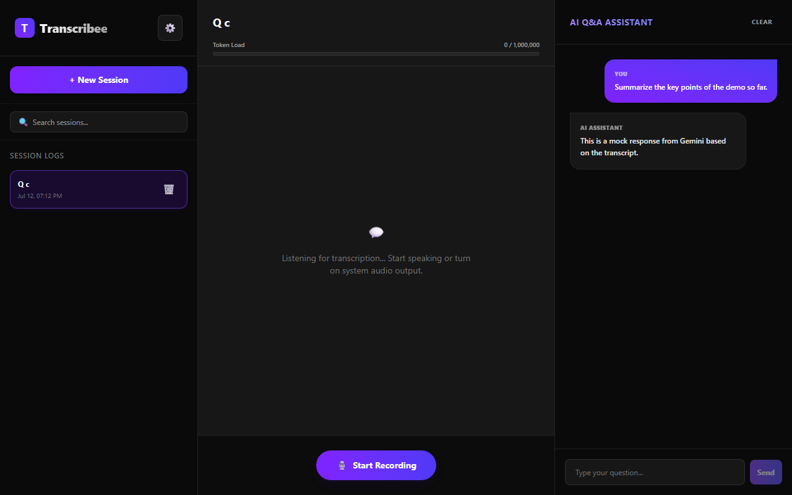
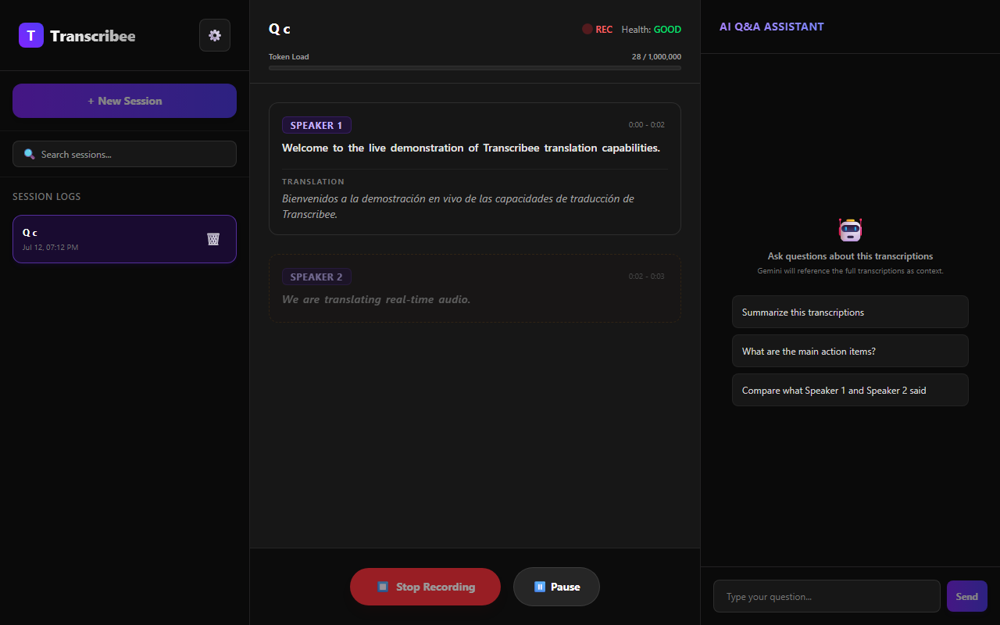
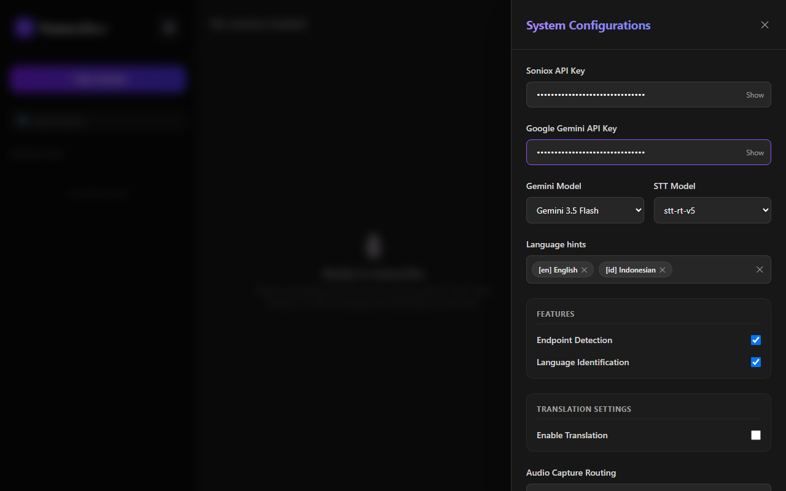
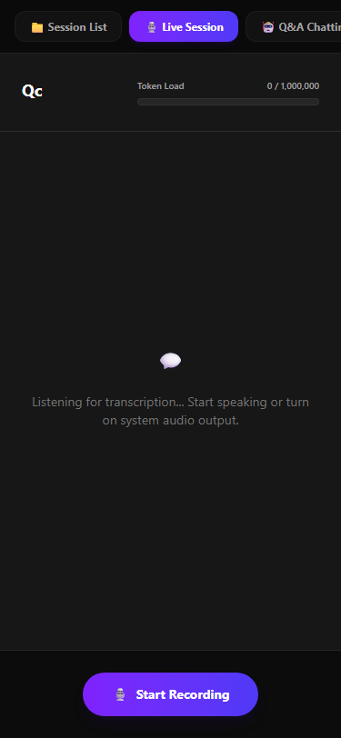

# Transcribee 🐝

> **Local-First, Real-Time Audio Transcription, Multi-Language Translation & AI Chat Assistant.**

Transcribee is a client-side orchestrator that runs entirely in the browser sandbox. It handles high-precision audio streaming, real-time speaker diarization, translation, token context guardrails, and client-side relational persistence—all without relying on intermediate application servers.

---

## 📸 Interface Preview

### Desktop Workspace

The unified desktop layout features a sidebar listing saved meeting sessions, a central live transcript viewer with speaker indicators, and an AI chat assistant panel on the right.



### Real-Time Transcription & Translation

Watch live transcription tokens settle. Refined (finalized) segments are rendered clearly, with concurrent translations displayed alongside. Click any transcribed word to play back the exact snippet of audio.



### System Configurations

A slide-out settings drawer allows managing your Soniox STT and Google Gemini API credentials. Tweak transcription models, active language identification hints, translation pathways, and hardware audio capture routes.



### Mobile-Responsive Layout

For smaller viewports, the interface automatically collapses into a fluid, tabbed navigation menu, prioritizing focus on the live session, session manager, or AI chat assistant as needed.



---

## ⚡ Core Features

1. **Audio Capture & Loopback Mixing**  
   Captures physical microphone inputs alongside software/system output audio (screen share loopback) and dynamically mixes them down to mono/stereo linear PCM (16kHz/44.1kHz) required by speech engines.

2. **Resilient Soniox Live STT Client**  
   Maintains a duplex WebSocket connection directly to Soniox STT to stream real-time word-level tokens, speaker diarization tags ("Speaker 1", "Speaker 2"), and translation segments.

3. **Token-Level Audio Playback (Audio Scrubbing)**  
   Maps textual tokens with absolute audio offset intervals (`start_ms` and `duration_ms`). Clicking any word in the transcript queries the local IndexedDB/OPFS audio cache and plays back that specific micro-segment.

4. **Smart FIFO Context Manager**  
   Calculates prompt token sizes locally. Displays a warning status when the compiled transcript reaches **85%** of Gemini's context window, and executes First-In, First-Out (FIFO) truncation at **100%** capacity to maintain context integrity.

5. **Gemini AI Chat Agent**  
   Invokes the `ChatGoogleGenerativeAI` model dynamically via LangChain JS. Streams responses to natural-language user queries directly within the browser using the session transcript as local context.

6. **Offline Persistence (Prisma WASM)**  
   Leverages Prisma Client compiled to WebAssembly along with a client-side PGlite/IndexedDB database engine to store session structures, transcript segments, AI chat logs, and binary audio buffers.

---

## 🛠️ Architecture Overview

```
                           +---------------------------------------+
                           |       Web Audio API Processing        |
                           |   (Mic Input + Speaker Loopback)      |
                           +-------------------+-------------------+
                                               | Raw Audio Buffer
                                               v
+-----------------------+  Audio Stream +------+------+   Real-Time Tokens  +------------------------+
|  Soniox Live STT Agent | ------------> |  RTK Global | <------------------ |   Gemini Chat Agent     |
|   (WebSocket Engine)  | <------------ | State Engine | ----------------->  |   (LangChain JS Client)|
+-----------------------+  Config / Keys +------+------+   Context Stream   +------------------------+
                                               |
                                               | Structured Payload Data
                                               v
                           +-------------------+-------------------+
                           |    Local-First Persistence Agent      |
                           |   (Prisma WASM + PGlite / IndexedDB)  |
                           +---------------------------------------+
```

---

## 🚀 Quickstart

### Prerequisites

- Node.js (v18+)
- npm or bun

### 1. Install Dependencies

```bash
npm install
# or
bun install
```

### 2. Start the Development Server

```bash
npm run dev
# or
bun run dev
```

Open [http://localhost:3000](http://localhost:3000) in your browser.

### 3. Running Tests

Transcribee uses Playwright to run end-to-end user flows with mock credentials and audio sources.

```bash
# Run tests
npx playwright test
```
